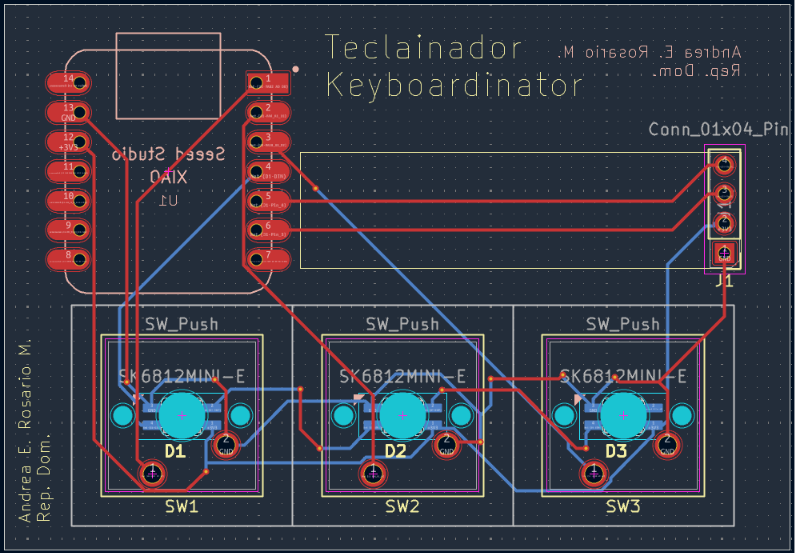
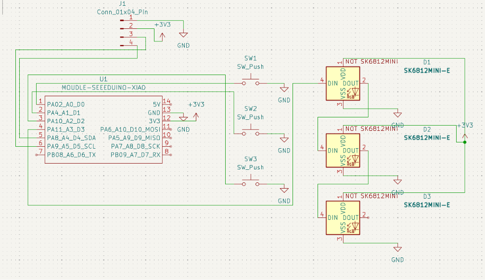

# ⌨️ Keyboardinator

Welcome to the official repository of the **Keyboardinator**, a compact, high-performance 3-key macropad built with style and precision. Designed to be your ultimate desk companion, this little mechanical powerhouse is engineered to optimize your workflow with a touch of "Ninja" stealth. 🚀

### 📸 Keyboardinator Preview

PCB

Sexy Schema

## 🛠️ The Ninja Arsenal (Features)
* **Triple Threat:** 3 mechanical switches programmed for lightning-fast productivity macros.
* **OLED Display:** Integrated 0.91" I2C screen (GND-VCC-SCL-SDA) to keep you informed of your current layer or status.
* **The Brains:** Powered by the incredibly compact Seeed Studio XIAO RP2040.
* **Firmware:** Powered by **KMK**, allowing for easy customization directly via CircuitPython.

## ⚙️ Ninja Mode (Functionality)
* **Key 1 (Work Simulator):** Instantly minimizes all windows (`Win + D`).
* **Key 2 (History Cleaner):** Closes the current browser tab (`Ctrl + W`).
* **Key 3 (Security Lock):** Locks your computer instantly (`Win + L`).

## 📦 Bill of Materials
You can find the full list of components required for this project in the [BOM.md](BOM.md) file.

## 📁 Repository Structure
* `/CAD`: 3D assembly of the case.
* `/PCB`: KiCad source files (`.kicad_pro`, `.kicad_sch`, `.kicad_pcb`).
* `/Firmware`: `main.py` source code for KMK.
* `/production`: Final files (Gerbers + STL + copy of `main.py`).

## 🛸 About the Project
The Keyboardinator is more than just a macropad—it's a journey into hardware engineering, PCB routing, and custom electronics. Designed with sleek corners and built for speed, this project transforms your setup into a true mission-control station.
