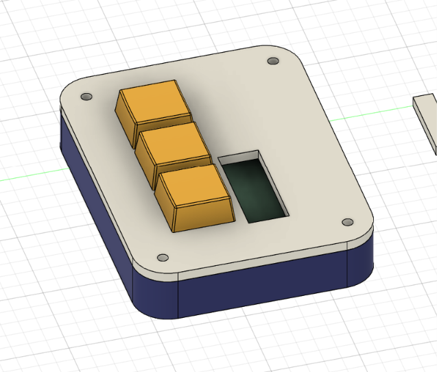
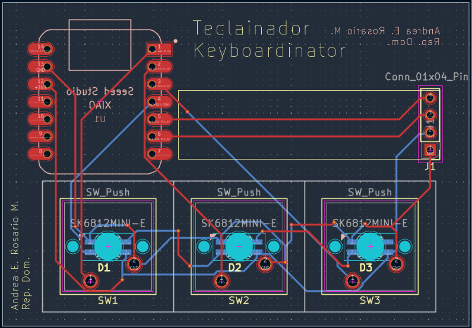
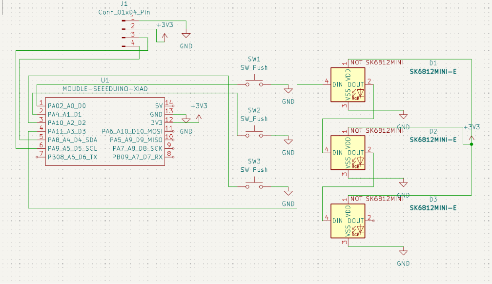

# Keyboardinator

Welcome to the Keyboardinator repository.

The Keyboardinator is a small 3-key macropad I made because apparently having a normal keyboard wasn't enough. It's built around a XIAO RP2040, three mechanical switches, and a tiny OLED screen.

The idea is pretty simple: three keys, three shortcuts, and hopefully a little less clicking around.

### Keyboardinator Preview

**3D Model**

**PCB**

 

**Sexy Schema**

### What's inside?
3 mechanical switches for the actual button pressing stuff.
0.91" OLED display connected through I2C (GND, VCC, SCL, SDA).
Seeed Studio XIAO RP2040 as the brain of the whole thing.
KMK + CircuitPython for the firmware, because I wanted something I could mess around with without making my life unnecessarily difficult.

### What do the keys do?

Nothing too complicated:

Key 1 — Work Simulator: Win + D
Makes the desktop appear. Very useful. Definitely not suspicious.
Key 2 — History Cleaner: Ctrl + W
Closes the current browser tab.
Key 3 — Security Lock: Win + L
Locks the computer.

The OLED is there to show the current status/layer and also because a macropad with a tiny screen is cooler than one without it.

##  Bill of Materials
You can find the full list of components required for this project in the [BOM.md](BOM.md) file.

## Repository Structure
/CAD 
  3D files for the case. 

/PCB 
  KiCad project files. 

/Firmware 
  main.py and the KMK/CircuitPython stuff. 

/production 
  Final files for actually making the thing: Gerbers, STL files and a copy of main.py.

### why did I make this?

Mostly because I wanted to learn how the whole process works.

This project involves a bit of everything: designing the case, making the PCB, routing it, figuring out the electronics, writing the firmware, and then trying to make all of it work together without something exploding.

It's a tiny project, but that's kind of the point. I wanted something I could actually finish and hold in my hands instead of another project that lives forever in a folder called final_final_v3.

Anyway, that's the Keyboardinator.
